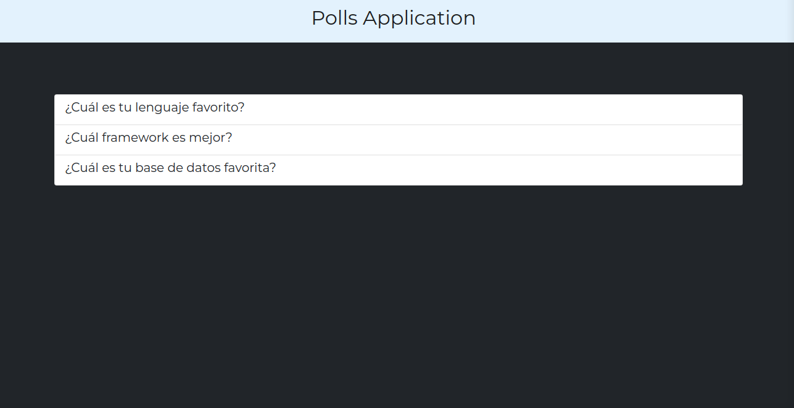
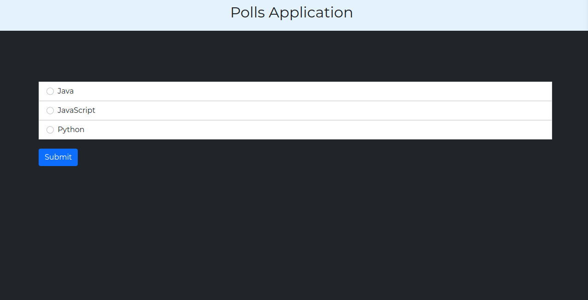
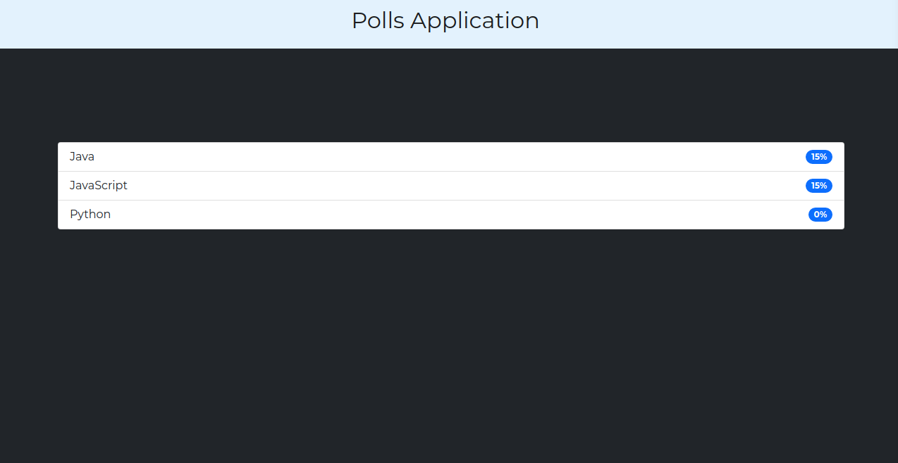

<h1>SystemsPolls</h1>

<em> Educamás -> <a href="https://educamas.com.co/">Programate</a> Cohorte IV REEDOM DEVELOPER. 💻  
</em>

System Polls 

⚙️ Technologies

☕  Python
 
☕  Framework: Django
 
☕  CSS and Bootstrap 5

⚙️ Deploy available: https://pollsap.herokuapp.com/polls/

